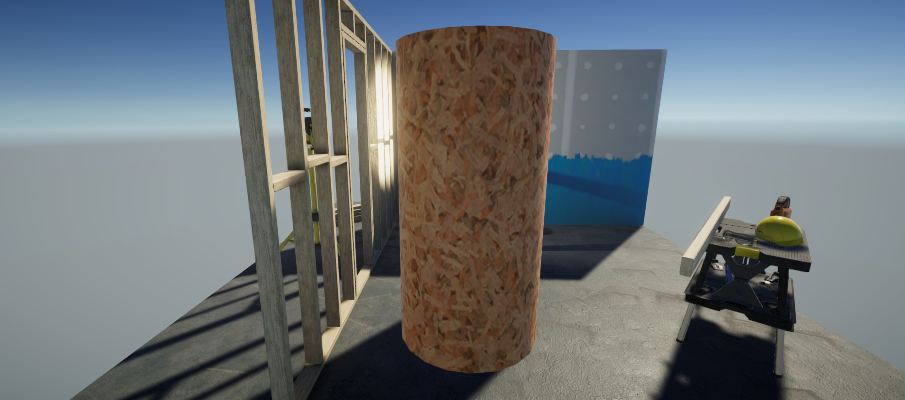
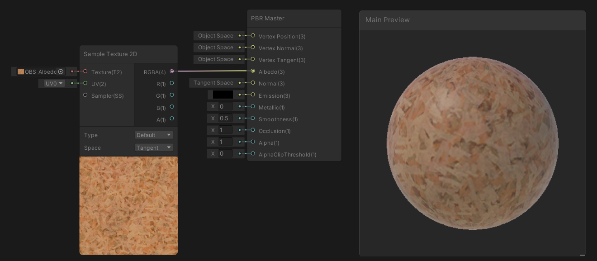

# URP
シェーダグラフでシェーダを描いてみよう

# 自分なりに変更した点
-
-
-

# 進め方

- 本リポジトリをフォークしてください
- フォークしたリポジトリをcloneします
- Unityのプロジェクトを更新して実装してください。
- このテキストファイルに変更点を記載してください
- result.pngを自分の結果を保存して差し替えてください
- node_graph.pngを自分のシェーダグラフの結果に差し替えてください
- プルリクエストを出して提出してください
